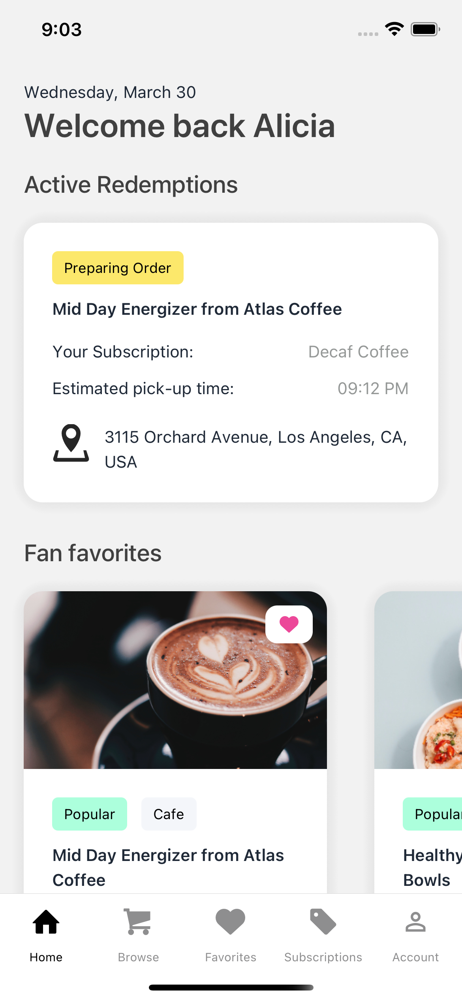
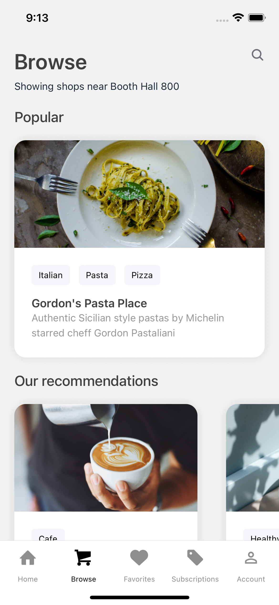
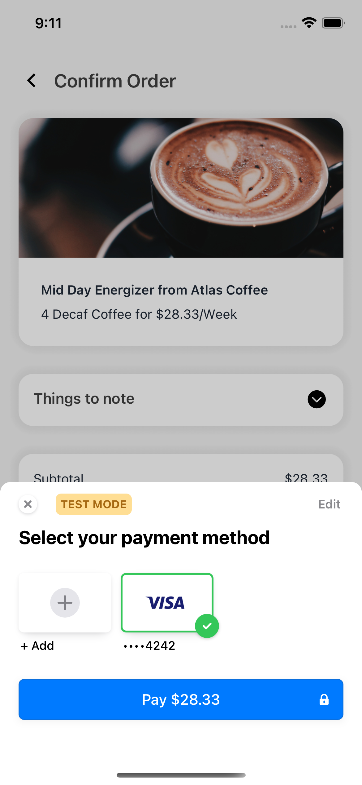

<!-- PROJECT LOGO -->
 

  
  <a href="https://punchcardapp.com">
    <h1 align="center">PunchCard</h1>
  </a>
  <h3 align="center">
    Discover and purchase subscriptions to your favorite local businesses
  </h3>

   &emsp14;&emsp14;&emsp14;&emsp14;
  &emsp14;&emsp14;&emsp14;&emsp14;&emsp14;&emsp14;&emsp14;&emsp14;
  

<!-- ABOUT THE PROJECT -->
## About The Project

**[PunchCard](https://punchcardapp.com)** is an app that allows you to discover and purchase subscriptions from your favorite local businesses. 
Think 5 coffees per week for the price of 3.

### Key Features
  - **Discovery**: Browse our app to discover new local businesses around you, and find out about the cost-saving subscriptions that they offer.
  - **Purchase**: Buy subscriptions for your favorite items with our in-app purchase system, cancel whenever you want. 
  - **Redeem**: Redeem your subscriptions on the app to place orders directly to merchants without any hassle in just two clicks. 

   &emsp14;&emsp14;&emsp14;&emsp14;
  &emsp14;&emsp14;&emsp14;&emsp14;&emsp14;&emsp14;&emsp14;&emsp14;
  

### Built With

* [React Native](https://reactnative.dev/)
* [Firebase](https://firebase.google.com/)
* [Stripe](https://stripe.com/)

<!-- CONTACT -->
## Contact

- **Colin Ho** - [Linked-In](https://www.linkedin.com/in/colin-ho99/) - colin@punchcardapp.com
